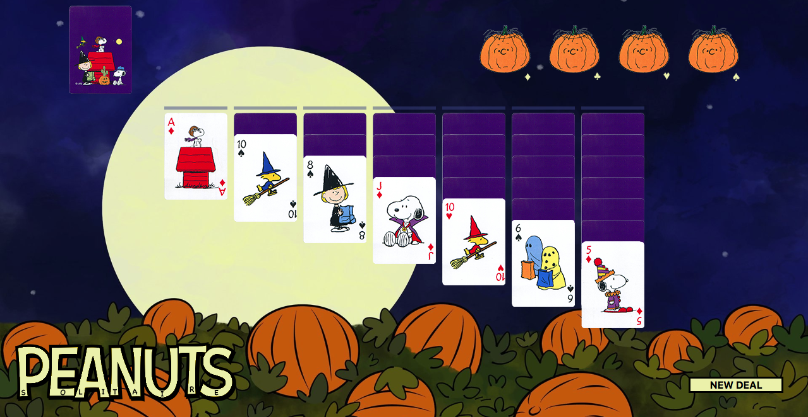

# Solitaire

<!-- A description of your game. Background info of the game is a nice touch. -->
Solitaire is a popular card game...

<!-- A screenshot or screenshots of your actual game makes your readme more colorful :) -->

<!-- Technologies Used: List of the technologies used. -->
## Technologies Used

<!-- Getting Started: In this section include the link to your deployed game and any instructions you deem important. -->

## Getting Started

<!-- Next Steps: Unsolved problems and/or planned features -->

## Next Steps

// Start Game

// Create storage of cards (shuffle)
   // How are they organized?
// Create shuffle loop

// DEAL DECK    
    // Distribute cards in columns and the rest goes into deal deck
        // Last card/stack facing up
        // These may be individual arrays/switch images accordingly. 

// Event listeners for user interactions
    // Click/Drag cards to responsive locations
        // This will require outlining which cards are compatible order wise and opening the return stack decks (A,S,C,D)
    // Alternating colors in descending order. Unlike ASCD chronological and suit based. 
        // RED/BLACK + KQJ10...
        // SUIT + A234...
    // User can click through deal deck for new card options that can then be put in play. 
        // If removed items must stay in order (.splice)
        // Stack of deal cards should have a refresh functionality at the end
    // These should be repeatable functions (loop)

    // Differentiate between VALID and INVALID moves

//Game over
    // User has unloaded all items into suit stacks - win
    // Forfeit because there are no moves left
    // Reset burton 

// How do transition cards and create valid input areas?