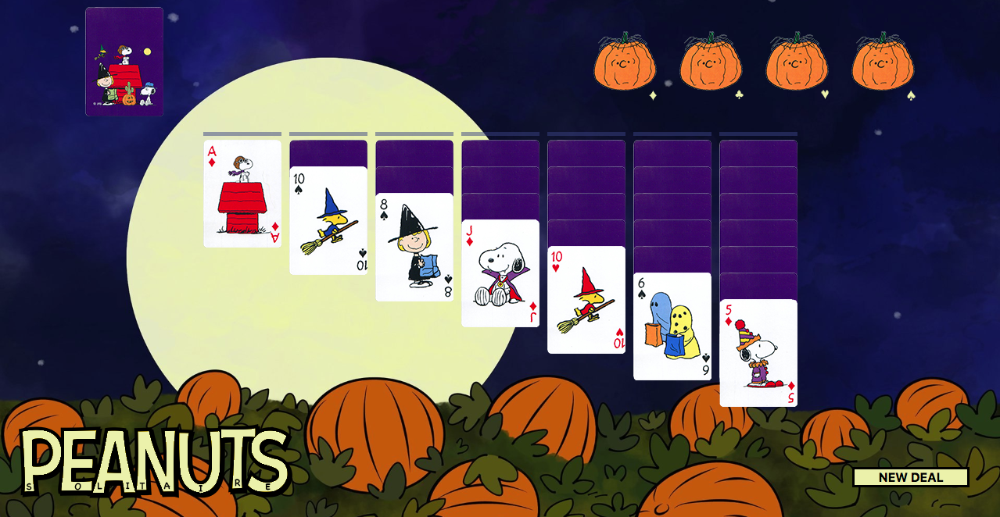

# Solitaire

Solitaire is a popular single-player card game. The object of the game is to collect descending columns of cards alternating colors and then move them into the foundation piles. 

There are several parameters and logistical hurdles regarding where a card can be placed.

This popular past time is a simple and fun way to kill time.!

## Technologies Used

This game was created with HTML, CSS, Javascript, and Adobe Photoshop.

## Getting Started

The game is accessible on GitHub Pages and is acccessible through this [link](https://jacksap.github.io/solitaire). 

As stated above, the object of the game is to empty all the cards from the tableau columns and the stock deck move them into the foundation piles.

## Next Steps

There are a couple of items I would like to address.

Although using the modulus operator works for determining the alternating pattern, it leaves an open gap in the Foundation arrays. Essentially, any Red card can be stacked on top of one another rather than cards of a single suit.

I think eventually manipulating the dragability of the items would be nice, especially if the stock/waste pile could be rendered in increments of 3.

Audio can be added along with other stylistic properties to elevate game play.

Although implementing the logic for a winning hand is more complex, eventually the User should be given the choice to access a WINNING DEAL mode.

The image on the bottom-left corner jumps and needs to be polished a bit.

Lastly, I would like to make this a more responsive deisgn, surrently it is designed with a laptop display in mind.

## Pseudocode

Below is my pseudocode for the game, I decided to include this as an insight into my building logic and thought processes.

    // Start Game

    // Create storage of cards (shuffle)
    // How are they organized?
    // Create shuffle loop

    // DEAL DECK    
        // Distribute cards in columns and the rest goes into deal deck
            // Last card/stack facing up
            // These may be individual arrays/switch images accordingly. 

    // Event listeners for user interactions
        // Click/Drag cards to responsive locations
            // This will require outlining which cards are compatible order wise and opening the return stack decks (A,S,C,D)
        // Alternating colors in descending order. Unlike ASCD chronological and suit based. 
            // RED/BLACK + KQJ10...
            // SUIT + A234...
        // User can click through deal deck for new card options that can then be put in play. 
            // If removed items must stay in order (.splice)
            // Stack of deal cards should have a refresh functionality at the end
        // These should be repeatable functions (loop)

    // Differentiate between VALID and INVALID moves

    //Game over
        // User has unloaded all items into suit stacks - win
        // Forfeit because there are no moves left
        // Reset burton 

    // How do transition cards and create valid input areas?